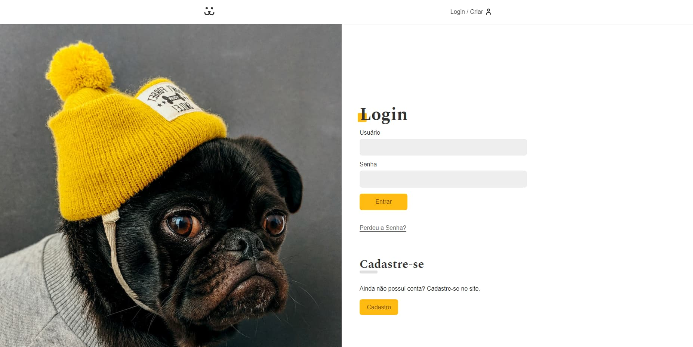

<h1 align="center" >Dogs - Rede social para cachorro</h1>

Meu projeto mais difícil e completo atualmente. Ele faz parte do curso de React da Origamid.

## </> **Tecnologias usadas**

As principais tecnologias usadas nesse projeto:

- HTML
- CSS
- JavaScript
- React
- React router dom
- Biblioteca externa Victory
- Wordpress api

## 📖 **Descrição do Projeto**

Uma rede social para cachorros onde você pode:
-criar uma conta
-fazer login
-recuperar e resetar sua senha
-postar foto do seu pet com nome, idade e peso para todos verem
-fazer comentários em outros posts
-ver as estatísticas dos seus posts

O backend atualmente está sendo usado com a api disponibilizada pelo próprio curso, mas futuramente irei criar a minha própria!

## 📖 **Como usar**
1. Clonar o repositório: **`git clone https://github.com/Alecell/octopost.git`**
2. Instalar as dependências: **`npm install`**
3. Iniciar o aplicativo: **`npm run dev`**

## 🔗 **Links**

- Aqui está o site original - https://dogs.origamid.dev

- Meu Twitter - https://twitter.com/gustavoGulArend
- Meu perfil no Front End Mentor com mais desafios - https://www.frontendmentor.io/profile/gustavogularte