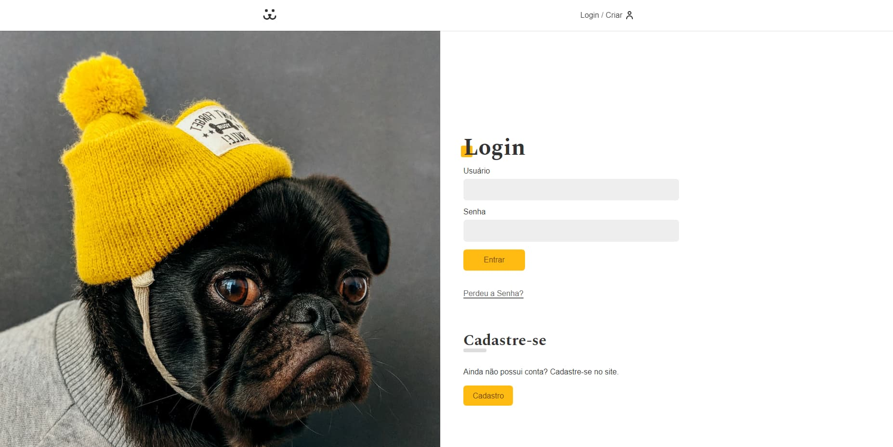

<h1 align="center">🐶 Dogs - Rede Social para Cachorros</h1>

<p align="center">
  Projeto desenvolvido durante o curso <strong>React Completo</strong> da Origamid.
</p>

<p align="center">
  
</p>

<p align="center">
  
  
  
  
  
  
  
  
  
</p>

---

# 📖 Sobre

O **Dogs** é uma rede social para cachorros desenvolvida durante o curso **React Completo** da Origamid.

A aplicação permite que usuários criem uma conta, façam login, publiquem fotos de seus pets, interajam através de comentários e acompanhem estatísticas das próprias publicações.

O projeto foi desenvolvido utilizando **React**, **React Router**, **WordPress REST API** como backend e a biblioteca **Victory** para geração de gráficos, colocando em prática conceitos importantes de desenvolvimento Front-end moderno.

---

# ✨ Funcionalidades

A aplicação possui diversas funcionalidades, entre elas:

- 👤 Cadastro de usuários
- 🔐 Login e autenticação
- 🔑 Recuperação e redefinição de senha
- 🐶 Cadastro de fotos dos pets
- 📝 Descrição das características dos animais
- 💬 Sistema de comentários
- ❤️ Feed de publicações
- 👤 Perfil do usuário
- 📊 Dashboard com estatísticas utilizando Victory
- 🔄 Consumo da WordPress REST API
- 📱 Layout totalmente responsivo

---

# 🚀 Conteúdos praticados

- ✅ React
- ✅ Componentização
- ✅ React Hooks
- ✅ React Router DOM
- ✅ Context API
- ✅ Fetch API
- ✅ Consumo de APIs REST
- ✅ Autenticação de usuários
- ✅ CRUD
- ✅ Upload de imagens
- ✅ Formulários
- ✅ Gerenciamento de estado
- ✅ Gráficos com Victory
- ✅ Organização de projetos
- ✅ Responsividade
- ✅ Boas práticas com React

---

# 🛠 Tecnologias

<p align="left">
  
  
  
  
  
  
  
</p>

---

# ⚙️ Como executar o projeto

1. Clone o repositório

```bash
git clone https://github.com/gustavogularte/projeto-dogs.git
```

2. Instale as dependências

```bash
npm install
```

3. Inicie a aplicação

```bash
npm run dev
```

---

# 🎯 Objetivo

Este projeto teve como objetivo consolidar meus conhecimentos em **React**, colocando em prática conceitos como componentização, gerenciamento de estado, autenticação, roteamento, consumo de APIs REST e criação de aplicações SPA completas.

Além disso, permitiu aprofundar conhecimentos sobre integração entre Front-end e Back-end utilizando a **WordPress REST API**, bem como a visualização de dados através da biblioteca **Victory**.

---

# 🔗 Links

- 🚀 **Deploy:** https://dogsgustavo.netlify.app/
- 🔌 **API utilizada:** https://github.com/gustavogularte/projeto-dogs-api
- 💼 **LinkedIn:** https://www.linkedin.com/in/gustavo-gularte-arend-58742a286/
- 🌐 **Meu perfil no Frontend Mentor:** https://www.frontendmentor.io/profile/gustavogularte
